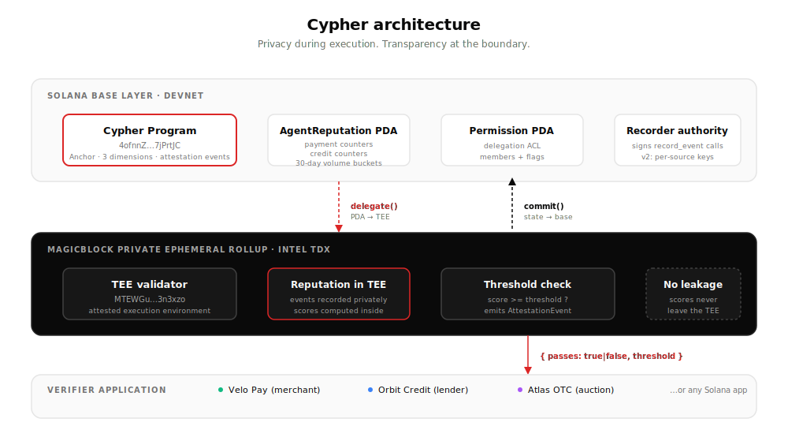

<div align="center">

# Cypher

**The missing primitive for the agent economy.**

A privacy-first reputation layer for AI agents on Solana, built inside MagicBlock's Private Ephemeral Rollup.

[**Live demo →**](https://cypher-devnet.vercel.app) · [**npm package →**](https://www.npmjs.com/package/@sonayonn/cypher-verify) · [**Verifier console →**](https://cypher-devnet.vercel.app/console) · [**Docs →**](https://cypher-devnet.vercel.app/docs)

</div>

---

## The insight

Every privacy use case on MagicBlock's RFP roadmap silently depends on agent reputation existing. Private payments require trust in payers. Undercollateralized lending requires creditworthiness. Sealed-bid auctions require volume verification. **None of these can ship without a reputation primitive underneath them.** Cypher is that primitive.

Three reputation dimensions — **Payment Reliability**, **Credit Worthiness**, **Volume Tier** — recorded privately, scored privately, attestable on demand. The verifier learns whether the agent meets a threshold. Nothing else.

## Demo

> *3-minute walkthrough — coming on submission day*


## Try it now

| Artifact | Where |
|---|---|
| 🌐 Live frontend | https://cypher-devnet.vercel.app |
| 📦 npm package | `npm install @sonayonn/cypher-verify` |
| 🔗 Solana program (devnet) | [`4ofnnZnnjkejk8Sk5ggjtAzAC9YSeVGTLuX1g7jPrtJC`](https://explorer.solana.com/address/4ofnnZnnjkejk8Sk5ggjtAzAC9YSeVGTLuX1g7jPrtJC?cluster=devnet) |
| 🤖 Demo agent | [`J15wEqvQvXJHGAZSaMbaEnnEvjV7JqLB6Ku2ZepB3CQ5`](https://explorer.solana.com/address/J15wEqvQvXJHGAZSaMbaEnnEvjV7JqLB6Ku2ZepB3CQ5?cluster=devnet) |
| ⚡ Verifier console | https://cypher-devnet.vercel.app/console |

Run the proof from a clean clone in 60 seconds:

```bash
git clone https://github.com/Sonayonn/cypher.git
cd cypher && yarn install
yarn cypher:demo
```

Output: 5 attestation tests against the live devnet program, all green.

## Architecture



State lives on Solana base layer. When attestation needs to happen, the agent's reputation PDA delegates into MagicBlock's Private Ephemeral Rollup — a Solana-compatible ephemeral rollup running inside an Intel TDX Trusted Execution Environment. Events record there, threshold checks compute there, and the only thing that crosses back to the verifier is a boolean: did the threshold pass?

Privacy during execution. Transparency at the boundary.

## Three markets, one primitive

| Cypher dimension | MagicBlock RFP | Demo scene |
|---|---|---|
| Payment Reliability ≥ 7 | Private MPP | [Velo Pay](https://cypher-devnet.vercel.app/scenes/velo-pay) — $13k merchant settlement |
| Credit Worthiness ≥ 6 | Undercollateralized lending | [Orbit Credit](https://cypher-devnet.vercel.app/scenes/orbit-credit) — $80k unsecured line |
| Volume Tier ≥ T3 | Sealed-bid auctions | [Atlas OTC](https://cypher-devnet.vercel.app/scenes/atlas-otc) — restricted-tier auction |

The three demo scenes are mocks demonstrating the integration shape. Cypher itself — the program, the PDA structure, the TEE flow, the attestation events — is real and live on devnet.

## Integrate in 30 lines

```ts
import { verifyAttestation, Dimensions } from "@sonayonn/cypher-verify";
import { PublicKey } from "@solana/web3.js";

const result = await verifyAttestation({
  agent: new PublicKey(agentPubkey),
  dimension: Dimensions.PaymentReliability,
  threshold: 7,
  wallet,        // any anchor-compatible wallet
  connection,    // Solana RPC connection
  idl,           // Cypher IDL
});

if (result.passes) {
  // grant access — agent's actual score is not revealed
  proceed();
}
```

Full integration guide: [docs page](https://cypher-devnet.vercel.app/docs).

## Privacy property

The verifier learns one thing: whether the agent meets the threshold they asked about. The verifier does **not** learn:

- The agent's actual score
- Underlying event counts (payments completed, loans on time, etc.)
- 30-day volume figures
- Any other dimension's score

This is enforced by the protocol: the AttestationEvent emitted on threshold check contains the score, but the score is bounded inside Cypher's own logic. Verifier applications using `@sonayonn/cypher-verify` receive a typed `{ passes: boolean }` return — by design.

## What's real vs. demo

**Real, on-chain, today:**
- Cypher Anchor program live on Solana devnet
- 3-dimension scoring with 7 distinct event types and integer-only math
- Full TEE delegation flow (proven in `tests/cypher-tee.ts`)
- AttestationEvent emission with parseable structure
- npm package published

**Demo, not yet real:**
- Velo Pay, Orbit Credit, Atlas OTC are convincing mocks demonstrating integration shape
- Demo agent's events were seeded by a script, not earned through real commerce
- Single oracle records all events (v2 introduces per-source authority)
- Devnet, not mainnet

## v2 roadmap

- Mainnet deploy with audited program
- Per-source authority — each merchant/lender signs its own events
- TEE-signed attestations verifiable off-chain without trusting the RPC
- Score economics calibrated against real agent behavior data
- Programmatic SDK for non-Solana verifiers

## Stack

Anchor 0.32 · Solana 2.0 · MagicBlock ephemeral-rollups-sdk 0.11.1 · Next.js 16 · TypeScript 5.6 · Tailwind 4 · shadcn/ui

## License

MIT
